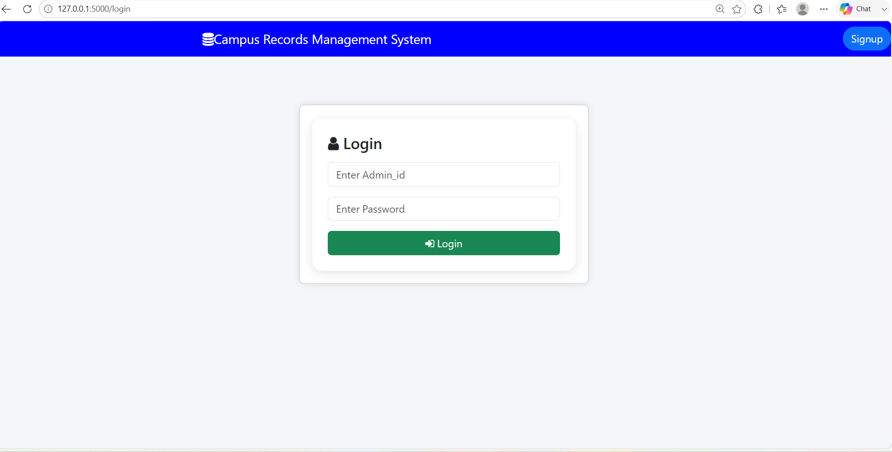
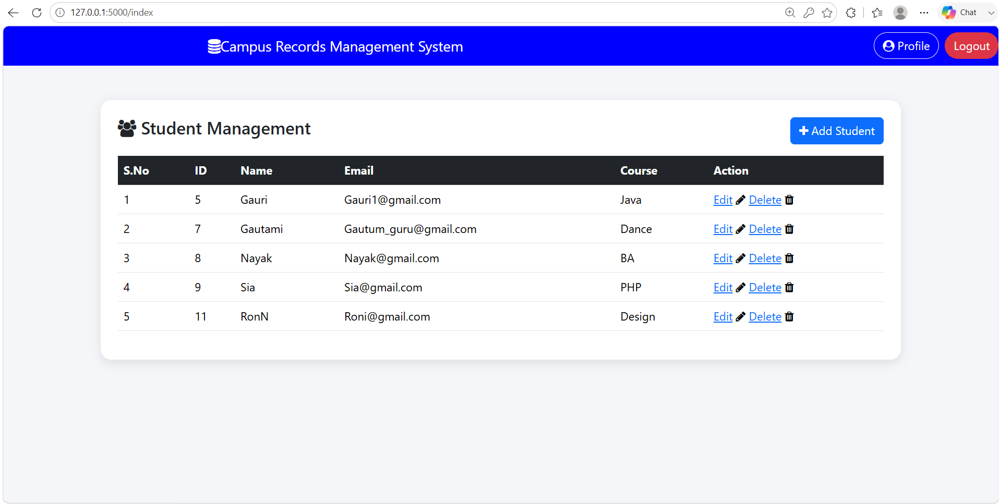

# Campus Records Management System

A web application designed to manage student records and administrative authentication. Built with Python, Flask, and MySQL, this project demonstrates structured MVC architecture, secure user authentication with password hashing, session management, and CRUD operations.

---

## Technical Stack & Architecture

* **Backend:** Python, Flask
* **Database:** MySQL
* **Database Driver:** `Flask-MySQLdb` / `mysqlclient`
* **Security & Auth:** Werkzeug Security (SHA-256 password hashing), Flask Sessions
* **Frontend Templating:** Jinja2, HTML5

---

## Features

* **Authentication & Authorization:**
  * Secure Admin Signup with automatic unique `Admin_id` generation.
  * Password hashing using Werkzeug’s security helpers.
  * Protected routes verifying active user sessions before granting access.
  * Admin profile management and session control (Logout).

* **Student CRUD Operations:**
  * **Create:** Add new student profiles (Name, Email, Course).
  * **Read:** Display all registered student records in a centralized dashboard.
  * **Update:** Modify existing student information by record ID.
  * **Delete:** Remove student records from the database.

* **Security & Config Isolation:**
  * Environment variable management using `.env` for sensitive database credentials.
  * Route modularization using Flask Blueprints (`auth_bp`).

---

## Database Schema Setup

Before running the application, set up the MySQL database and required tables.

```sql
CREATE DATABASE flask_crud;
USE flask_crud;

-- Admins Table
CREATE TABLE admins_record (
    Admin_id INT AUTO_INCREMENT PRIMARY KEY,
    Name VARCHAR(100) NOT NULL,
    Department VARCHAR(100) NOT NULL,
    Email VARCHAR(100) UNIQUE NOT NULL,
    Password VARCHAR(255) NOT NULL
);


-- Students Table
CREATE TABLE students (
    id INT AUTO_INCREMENT PRIMARY KEY,
    name VARCHAR(100) NOT NULL,
    email VARCHAR(100) NOT NULL,
    course VARCHAR(100) NOT NULL
);
Installation & Setup
1. Clone the Repository:

Bash
git clone [https://github.com/your-username/student-management-system.git](https://github.com/your-username/student-management-system.git)
cd student-management-system
2. Create and Activate a Virtual Environment:

Bash
python -m venv venv
# On Windows:
venv\Scripts\activate
# On macOS/Linux:
source venv/bin/activate
3. Install Dependencies:

Bash
pip install Flask Flask-MySQLdb python-dotenv werkzeug
4. Configure Environment Variables:
Create a .env file in the root directory with your MySQL credentials:

Code snippet
MYSQL_HOST=localhost
MYSQL_USER=root
MYSQL_PASSWORD=your_mysql_password
MYSQL_DB=flask_crud
5.Run the Application:

Bash
python app.py
Navigate to http://127.0.0.1:5000 in your web browser.

#Project Structure
Plaintext
├── app.py              # Application entry point, main routes, and CRUD operations
├── auth.py             # Authentication Blueprint (Signup, Login, Profile, Logout)
├── config.py           # Configuration loader reading from environment variables
├── .env                # Environment variables (Git-ignored)
└── templates/          # Jinja2 HTML templates
    ├── add.html
    ├── edit.html
    ├── index.html
    ├── login.html
    ├── profile.html
    └── signup.html

```
---


**📸 Screenshots**

### Login Page


### Dashboard



### 1. Signup Page


### 2. Login Page


### 3. Dashboard


### 4. Add Record


### 5. Edit Record


### 6. Profile Page


